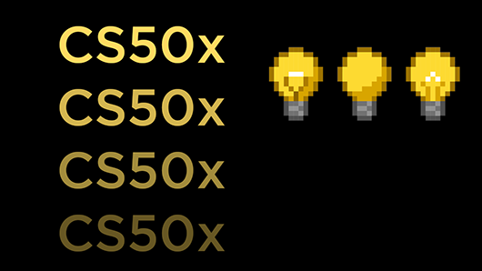

# CS50x-Week8-Solution-With-Deep-Explanation
# Trivia Game and Mini Portfolio

⭐️ **Star this repository! It really motivates me to make better explanations and produce more work!!** ⭐️

## Overview
This repository contains two projects:

1. **Trivia Game** - A simple game to test your knowledge with multiple-choice and free-response questions.
2. **Mini Portfolio Homepage** - A homepage that serves as a mini portfolio, showcasing your skills and projects.

---

## Project 1: Trivia Game

### Description
The Trivia Game is built using HTML, CSS, and JavaScript. It features two parts:

- **Part 1**: Multiple Choice Questions
- **Part 2**: Free Response Question

The game provides instant feedback on the correctness of answers after each submission.

### 1. `index.html`

#### Purpose
The `index.html` file structures the content of the trivia game, including both multiple-choice and free-response questions.

#### Key Sections

- **Header**: Displays the title: *Trivia!*.
- **Part 1: Multiple Choice Questions**: 
  - Question: "What is the capital of Kazakhstan?"
  - Four answer choices: Astana, Almaty, Shymkent, Aktobe.
  - Submit button to check the user's answer.
- **Part 2: Free Response Question**:
  - Asks: "What is 10 + 10?"
  - Input field for the user to submit their answer.
  - Submit button to verify the answer.

#### Key Points

- Uses HTML to structure the content.
- JavaScript provides functionality to check if the selected or entered answers are correct.
- CSS styles the layout and look of the game.

### 2. `style.css`

#### Purpose
The `style.css` file is responsible for the styling and layout of the trivia game.

#### Key Points

- **Body Styles**: 
  - Global font style using `font-family: sans-serif`.
  - Consistent margin and padding.
- **Header Styles**: 
  - Centers the title "Trivia!" using `text-align: center`.
  - Adds a background color `#eee` and padding.
- **Question and Button Styles**: 
  - Buttons styled with padding, background color, and hover effects.
  - Clear spacing and alignment for the question containers.

### 3. `script.js`

#### Purpose
The `script.js` file adds interactivity to the trivia game by handling user input, validating answers, and providing feedback.

#### How it Works

- **Multiple-Choice Section**: 
  - On selecting an answer and clicking Submit, the script checks if it's correct and displays feedback.
- **Free-Response Section**: 
  - After inputting the answer to "What is 10 + 10?" and clicking Submit, the script checks if the answer is 20 and provides feedback.

#### Key Points

- **Event Listeners**: 
  - JavaScript adds click event listeners to both Submit buttons.
- **Answer Validation**: 
  - The script compares the selected multiple-choice option with the correct answer.
  - It also checks the free-response input against the correct answer (20).

### How to Run

1. Clone or download the repository.
2. Open `index.html` in a web browser to play the trivia game.
3. Ensure `style.css` and `script.js` are in the same directory as `index.html`.

---

## Project 2: Mini Portfolio Homepage

### Description
The Mini Portfolio Homepage is a professional web page showcasing your skills, projects, and services. It acts as a personal portfolio to introduce yourself and display your work.

### 1. `index.html`

#### Purpose
The `index.html` file serves as the main page of your mini portfolio.

#### Key Sections

- **Header Section**: 
  - Displays the site’s title and navigation menu.
  - Links to Home, About, and Services pages.
- **Main Sections**:
  - **Hero Section**: Prominent introduction with a tagline and call-to-action button.
  - **About Section**: Brief overview of your background, skills, and expertise.
  - **Services Section**: Lists services you offer (e.g., web development, design).
  - **Projects Section**: Showcases your projects with descriptions and links to GitHub or live demos.
- **Footer Section**: 
  - Includes social media links and contact information.

#### Key Points

- Responsive design for good experience on both desktop and mobile.
- Clean and semantic HTML for readability and SEO.
- Displays an overview of your skills and past work to potential employers or clients.

### 2. `style.css`

#### Purpose
The `style.css` file is responsible for the overall look and feel of the portfolio page.

#### Key Points

- **Responsive Design**: 
  - Ensures layout looks good on all screen sizes, from mobile to desktop.
- **Typography and Colors**: 
  - Consistent font and color scheme to create a professional look.
- **Section Styling**: 
  - Each section (Hero, About, Services, Projects, Footer) is visually appealing.
- **Button and Link Styles**: 
  - Buttons have hover effects to enhance user experience.

### 3. Additional Pages

- **`services.html`**: A page detailing the services offered.
- **`about.html`**: A page where users can learn more about your background and expertise.

### How to Run

1. Clone or download the repository.
2. Open `index.html` in a web browser to view the portfolio homepage.
3. Customize the content in `index.html`, `services.html`, and `about.html` to reflect your personal details.

## Credits

<table>
  <tr>
    <td></td>
    <td>
      <h3>Credits to CS50x</h3>
      
This project was inspired by and developed as part of the CS50x course offered by Harvard University. CS50x is Harvard University's introduction to the intellectual enterprises of computer science and the art of programming for majors and non-majors alike, with or without prior programming experience.

      <ul>
        <li><strong>Course:</strong> CS50x: Introduction to Computer Science</li>
        <li><strong>Institution:</strong> Harvard University</li>
        <li><strong>Instructor:</strong> David J. Malan</li>
        <li><strong>Website:</strong> <a href="https://cs50.harvard.edu/x/2024/">CS50x Official Site</a></li>
      </ul>
      
Thank you to the CS50x team for providing such a comprehensive and engaging introduction to computer science.

    </td>
  </tr>
</table>
